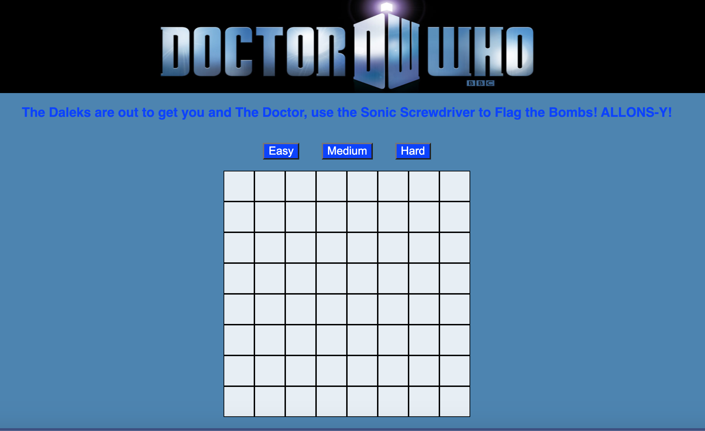

[Minesweeper](https://minesweeper-mandywade.netlify.app/)

The objective of this assignment was to build the user interface for a classic Minesweeper game that will communicate with backend [API](https://minesweeper-api.herokuapp.com/) server.

Following technologies used:

- [React](https://reactjs.org/)
- [React Mouse Events](https://reactjs.org/docs/events.html#mouse-events)
- APIs
- [JavaScript Fetch Quick Reference](https://handbook.suncoast.io/lessons/misc-quick-reference/js-fetch)
- [Two Dimensional Arrays in React](https://www.pluralsight.com/guides/display-multidimensional-array-data-in-react)
